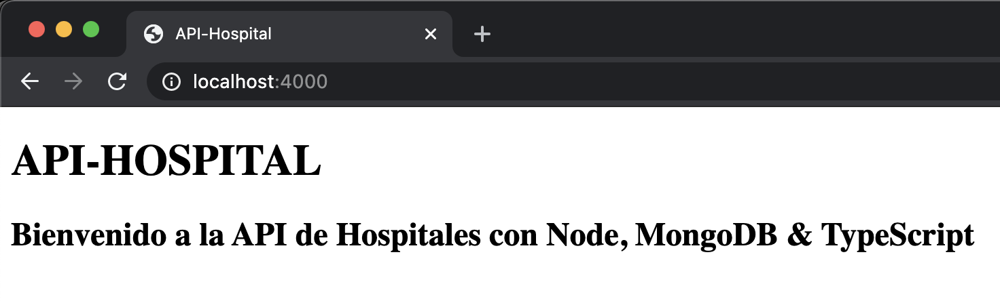

# API Hospital


## Proyecto Final - **Back-End**

**REST API que contiene el CRUD para un HOSPITAL:** consulta, registro, actualización y borrado de Usuarios, Hospitales y Doctores.

**Puntos importantes de la API:**

- Se incluye implementación de [JSON Web Tokens](https://jwt.io/) para la generación del token de seguridad e enviarlos en los métodos implementados.
- Se utilizó POO para el diseño de esta solución.
- Se realizaron 4 controladores para MongoDB -> [AuthController](controllers/AuthController.ts), [UsersController](controllers/UsersController.ts), [HospitalsController](controllers/HospitalsController.ts) y [DoctorsController](controllers/DoctorsController.ts).
- Se utilizaron Interfaces para poder definir el esquema y comportamiento de los Controladores.
- En [Validators.ts](helpers/Validators.ts) se definen reglas de negocio y lógica intermedia para validación en los controladores.
- Se crearon **2 Middlewares**; [ValidateToken.ts](middlewares/ValidateToken.ts) que contiene la validación del token de seguridad recibido. Y [ValidateFields.ts](middlewares/ValidateFields.ts) que contiene la validación de los campos recibidos en los Request, mostrando los errores detectados si fuera el caso.
- El acceso a datos se encuentra implementado con Mongoose para MongoDB.
- Para realizar la conexión con la DB se utilizaron Singleton pattern, aplicando static, private, etc.
- Se implemento un [index.html](public/index.html) para validar la API desde [LocalHost](http://localhost/4000).



## Proyecto Escrito 📖

- Puedes encontrar la sección del [Proyecto Escrito](https://github.com/ChuyGonzalez/BK_HospitalApi/wiki/PROYECTO-ESCRITO) en la Wiki del proyecto.

## Documentación de API

- Diagrama de Arquitectura de API REST:


  
- **Tabla de Documentación de Diseño de métodos** - [Descargar Excel](/Documents/APIHospital.xlsx).

- **Diagrama de Clases de API** - [Descargar Diagrama](/Documents/diagramClass.drawio).
  
- **Documentación de API con POSTMAN**: 

> - [Descargar POSTMAN](https://www.getpostman.com/collections/0f05ba9c7af36440faa7)

> - [Ver documentación POSTMAN](https://documenter.getpostman.com/view/257435/TzY1iwom)

- **Diagrama de Base de Datos ER**: Debido a que la BD es NoSQL, la relación en tablas es logico.


- **Documentación de Pruebas Unitarias de API con POSTMAN** - [Descargar JSON](/Documents/ApiHospital.postman_test_run.json).

## Construido con 🛠️

- [Node.JS](https://nodejs.org/en/) - El framework Node.JS.
- [Mongoose](https://mongoosejs.com/) - ‎Modelado ‎‎de objetos MongoDB‎ elegante para ‎‎Node.JS‎
- [TypeScript](https://www.typescriptlang.org/) - Tipeado de JavaScrit con ‎TypeScript.
- [Heroku](https://devcenter.heroku.com/) - Publicada y alojada en **Heroku**.

## Comenzando 🚀

**Estas instrucciones te permitirán obtener una copia del proyecto para el funcionamiento en tu máquina local para propósitos de desarrollo y pruebas.**

1. Clone the repo:

   ```sh
   git clone https://github.com/ChuyGonzalez/BK_HospitalApi.git
   ```

2. Install NPM packages:

   ```sh
   npm install
   ```

3. Run Dev:

    *npm*

    ```sh
    npm run start:dev
    ```

    *Yarn*

    ```sh
    yarn start:dev
    ```

4. Run Build:

    *npm*

    ```sh
    npm run start
    ```

    *Yarn*

    ```sh
    yarn start
    ```

5. Run Build:

    *npm*

    ```sh
    npm run build
    ```

    *Yarn*

    ```sh
    yarn build
    ```

6. Run Build && Node dist:

    *npm*

    ```sh
    npm run start
    ```

    *Yarn*

    ```sh
    yarn start
    ```

## Pre-requisitos 📋

### Base de Datos

Ejecutar los siguientes pasos y comandos en consola de MongoDB:

1. Crear la Base de Datos con [MongoDB - Create Cluster](https://docs.atlas.mongodb.com/tutorial/create-mongodb-user-for-cluster).
2. Comando para mostrar las Bases de Datos:

    ```bash
    db
    ```

3. Seleccionar la Bases de Datos **dbHospital**:

    ```bash
    use dbHospital;
    ```

4. Crear la colección de **Usuarios**:

    ```bash
    db.createCollection("users");
    ```

5. Crear la colección de **Hospitales**:

   ```bash
    db.createCollection("hospitals");
    ```

6. Crear la colección de **Doctores**:

   ```bash
    db.createCollection("doctors");
    ```

### Environment ⚙️

**Modificar el archivo .env con tus datos a ocupar de Puerto, Conexión a BD y Secret Key.**

## Despliegue 📦

- Para realiza el despligue por favor tome en cuenta los siguientes pasos: [Deploy-Keys](https://docs.github.com/en/developers/overview/managing-deploy-keys#deploy-keys)

- Encontraras la API publicda en [Heroku](https://api-node-hospital.herokuapp.com/). Si deseas desglegar tu API ve la siguiente [documentación](https://devcenter.heroku.com/).

## Versionado 📌

Usamos [SemVer](http://semver.org/) para el versionado. Para ver todas las versiones disponibles, mira los [tags en este repositorio](https://github.com/ChuyGonzalez/BK_HospitalApi/tags).

## Autores ✒️

- **Jesús González** - *Creación, diseño y desarrollo de Proyecto* - [Chuy Gonzalez](https://github.com/ChuyGonzalez).

También puedes mirar la lista de todos los [Contribuidores](https://github.com/ChuyGonzalez/BK_HospitalApi/graphs/contributors) quíenes han participado en este proyecto.

---
⌨️ por :robot: [Chuy Gonzalez](https://github.com/ChuyGonzalez) 😊
